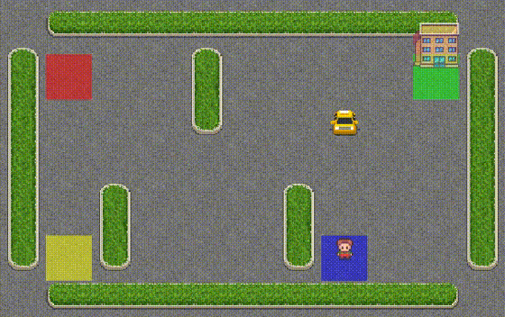

<h1 align="center">Hi 👋, I'm Inzaghi </h1>

  A <strong>Math</strong> student at <strong>UBC</strong> with a background in Manufacturing Engineering and a passion for computer vision, robotics, and human-computer interaction.

  
  

---

### 📌 About Me

* 🎓 Studying **Math** @ **The University of British Columbia (UBC)**
* 🔧 Previously: SDE @ Amazon, UBC Robotics & Control Lab, NC4 Lab, UBC Medicine
* 🔬 Research Experience: Computer Vision (Object Pose Tracking), Virtual Reality (VR) & Augmented Reality (AR)

 

### 🚀 Core Interests

| Academic Focus | Personal Passions |
| :--- | :--- |
  | 👀 Computer Vision  | 🥽 Virtual Reality | 🐾 Reinforcement Learning
| 🔍 Human-Computer Interaction | 🤖 Robotics |
| | 🎮 Game Development |

 

### 💻 Featured Projects

   
   
   
  

---

### ☕ Support My Work

  

  
